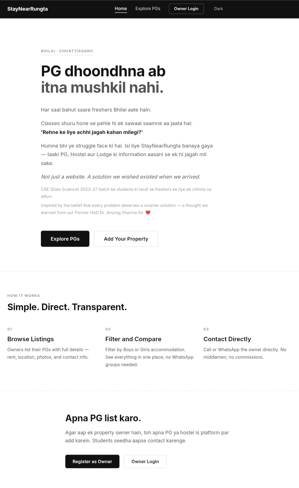
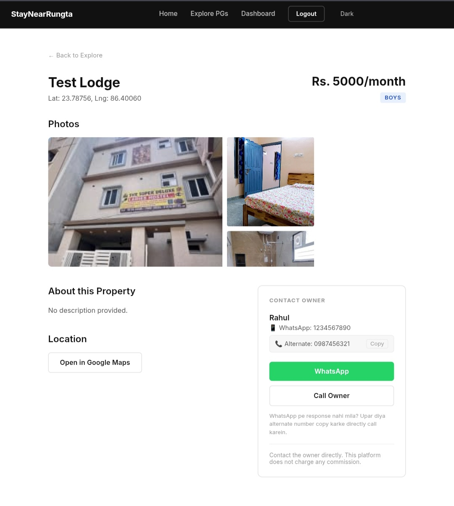
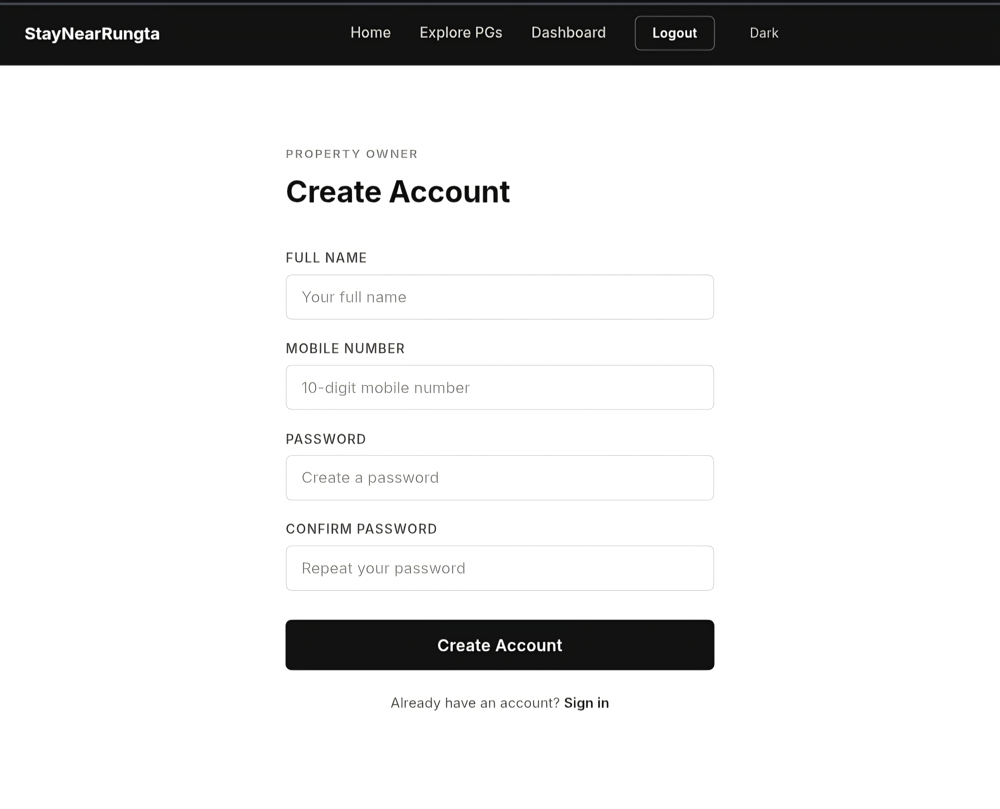
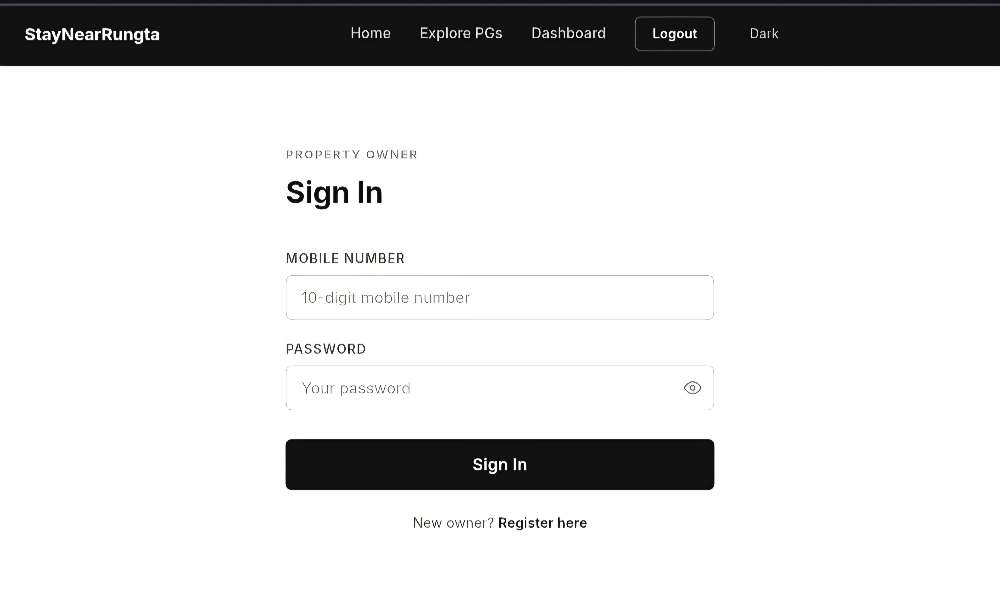
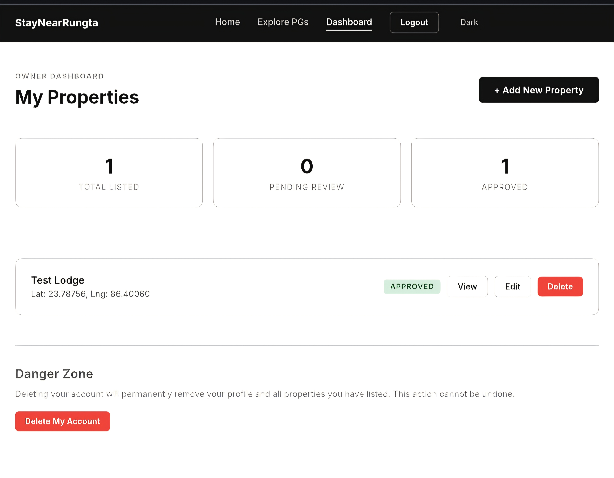

StayNearRungta

StayNearRungta is a full-stack accommodation and property listing platform that helps students and working professionals discover nearby rental properties, rooms, hostels, and PG accommodations around the Rungta area.

Features

Property Search

- Browse available properties
- View detailed property information
- Explore accommodations with images and amenities
- Responsive user interface

Owner Portal

- Owner Registration
- Owner Login
- Add New Property
- Manage Property Listings
- Upload Property Images

Admin Portal

- Admin Registration
- Admin Login
- Admin Dashboard
- Property Management
- Owner Management

Security

- JWT Authentication
- Protected Routes
- Secure API Access

Tech Stack

Frontend

- React
- Vite
- Context API
- Custom Hooks

Backend

- Node.js
- Express.js
- MongoDB
- JWT Authentication
- Cloudinary
- Multer

Project Structure

StayNearRungta/
├── frontend_edit/
├── backend_edit/
├── screenshots/
└── README.md

## 📸 Screenshots

| Page | Preview |
|------|--------|
| Landing |  |
| Details |  |
| Register |  |
| Login |  |
| Dashboard |  |
Backend Setup

cd backend_edit
npm install

Create a ".env" file using ".env.example".

npm start

Frontend Setup

cd frontend_edit
npm install
npm run dev

Environment Variables

Required backend environment variables:

- MONGODB_URI
- JWT_SECRET
- CLOUDINARY_CLOUD_NAME
- CLOUDINARY_API_KEY
- CLOUDINARY_API_SECRET

Author

Md Adnan
